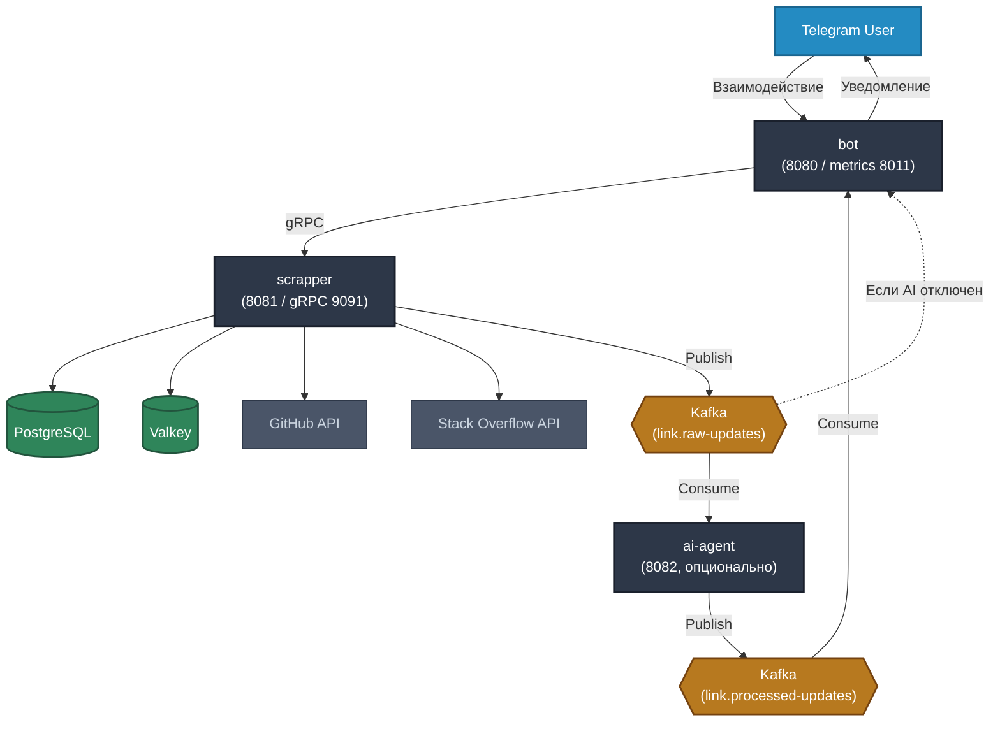

# LinkTracker

LinkTracker - Telegram-бот, который отслеживает изменения на GitHub-репозиториях и вопросах Stack Overflow и оперативно информирует пользователя о них.

## Архитектура



 `scrapper`  Хранение ссылок, polling внешних API, отправка уведомлений 
 `bot`  Telegram UI, gRPC-клиент к scrapper, consumer Kafka 
 `ai-agent`  Фильтрация, суммаризация и группировка событий из Kafka 
 `load-service`  Нагрузочное тестирование (профиль `performance`) 
 `common-proto`  gRPC-контракты и Avro-схемы 

Подробнее о мониторинге: [OBSERVABILITY.md](OBSERVABILITY.md).

## Требования

- Maven 3.9.12+
- Docker и Docker Compose
- [Telegram Bot Token](https://t.me/botfather)
- GitHub Personal Access Token
- Stack Overflow API key

## Быстрый старт (Docker)

### 1. Секреты

Создайте файл `.env` в корне репозитория (он в `.gitignore`):

```env
TELEGRAM_TOKEN=your-telegram-bot-token
GITHUB_TOKEN=your-github-token
STACKOVERFLOW_KEY=your-stackoverflow-key
```

### 2. Запуск

```bash
docker compose up --build
```

После старта доступны:

 Сервис URL 
 Bot (HTTP)| http://localhost:8080 
 Bot metrics  http://localhost:8011/metrics 
 Scrapper (HTTP)  http://localhost:8081 
 Scrapper metrics  http://localhost:8081/metrics 
 Prometheus  http://localhost:9090 
 Grafana  http://localhost:3000 (admin / admin) 
 Jaeger UI  http://localhost:16686 

### 3. Остановка

```bash
# с удалением volumes
docker compose down -v

# повторный запуск (без пересборки)
docker compose up -d
```

## Локальная разработка (без Docker)

1. Поднимите инфраструктуру: PostgreSQL, Valkey, Kafka (или `docker compose up postgres valkey1 valkey2 valkey3 kafka1 kafka2 kafka3 kafka-init schema-registry`).
2. Экспортируйте переменные окружения (`TELEGRAM_TOKEN`, `GITHUB_TOKEN`, `STACKOVERFLOW_KEY`).
3. Соберите и запустите модули:

```bash
mvn clean package -DskipTests

# scrapper
java -jar scrapper/target/scrapper-*.jar

# bot
java -jar bot/target/bot-*.jar

# ai-agent (для полного Kafka-pipeline)
java -jar ai-agent/target/ai-agent-*.jar
```

## Сборка и тесты

```bash
# все модули
mvn clean verify

mvn clean verify -pl build-report-aggregate -am
```


## Команды бота

 Команда  Описание 
 `/start`  Главное меню 
 `/help`  Справка 
 `/track`  Добавить ссылку на отслеживание 
 `/untrack`  Убрать ссылку 
 `/list`  Список отслеживаемых ссылок 
 `/addTag`  Добавить тег к ссылке 
 `/removeTag`  Удалить тег 

Поддерживаемые источники: `github.com`, `stackoverflow.com`.

## Профиль performance

Нагрузочное тестирование и сравнение режимов планировщика (`VIRTUAL_THREADS` / `OS_THREADS` / `SINGLE_THREAD`):

```bash
docker compose --profile performance up --build
```

Сервис `load-service` доступен на порту `8090`.

## Полезные ссылки

- [OBSERVABILITY.md](OBSERVABILITY.md) — Prometheus, Grafana, метрики, PromQL
- [example_pql.txt](example_pql.txt) — PromQL-запросы для дашбордов
